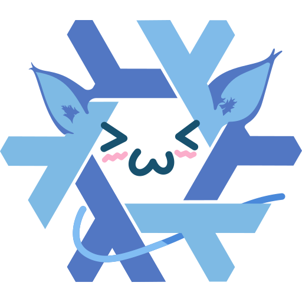

# NixOwO
Cuter Nix logo (SVG)

I took the probably handdrawn chibi Nix logo from [here](https://github.com/TheDarkBug/uwufetch/blob/main/res/nixos.png) and traced it in Inkscape.

The plain version should be used for web and similar. The wip version still has the helper layer and a few other extras for editing. The last version is missing the helper layer, but still has some Inkscape data.

## licence
[CC-BY license](https://creativecommons.org/licenses/by/4.0/)
### Base artwork:
- Copyright Holder: Tim Cuthbertson (@timbertson)
- License: [CC-BY license](https://creativecommons.org/licenses/by/4.0/)
- [Reference](https://github.com/NixOS/nixos-artwork/tree/master/logo#nixos-logo)
### Modifications
- Description: uwu style
- Copyright Holder: [u/ant-artica](https://www.reddit.com/user/ant-artica)
- License: [CC-BY license](https://creativecommons.org/licenses/by/4.0/)
- [Reference](https://www.reddit.com/r/linuxmasterrace/comments/lzdwl4/nixowos/)
### Modifications
- Description: cleanup and vectorizing
- Copyright Holder: [TilCreator](https://tils.pw)
- License: [CC-BY license](https://creativecommons.org/licenses/by/4.0/)
- [Reference](https://github.com/TilCreator/NixOwO)
